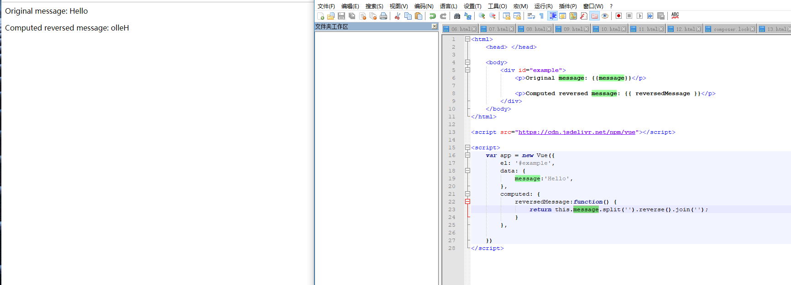
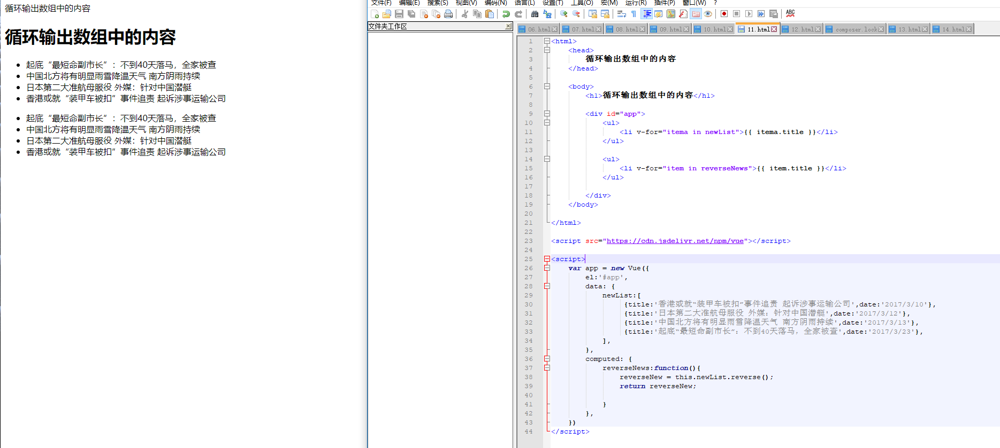

学习vue的时候使用计算属性对数组进行反转，发现执行完 reverse()函数以后，它的原值和反转后的值都一样

但是，对于反转字符串发现，根据vue的官方例子发现原值和反转后的值不一样，也就是可以输出到原值，一看，不对呀，如果说字符串反转可以输出原值和反转后的值，那么对于数组来说也是一样的呀，这是我的第一想法。

代码和运行结果如下:

- 反转字符串

代码如下:

```

<html>
	<head> </head>
	
	<body>
		<div id="example">
			<p>Original message: {{message}}</p>
			
			<p>Computed reversed message: {{ reversedMessage }}</p>
		</div>
	</body>
</html>

<script src="https://cdn.jsdelivr.net/npm/vue"></script>

<script>
	var app = new Vue({
		el: '#example',
		data: {
			message:'Hello',
		},
		computed: {
			reversedMessage:function() {
				return this.message.split('').reverse().join('');
			}
		},
		
	})
</script>	

```

运行结果:




- 反转数组

代码如下:

```
<html>
	<head>
		循环输出数组中的内容
	</head>
	
	<body>
		<h1>循环输出数组中的内容</h1>
		
		<div id="app">
			<ul>
				<li v-for="itema in newList">{{ itema.title }}</li>
			</ul>
			
			<ul>
				<li v-for="item in reverseNews">{{ item.title }}</li>
			</ul>
			
		</div>
	</body>

</html>

<script src="https://cdn.jsdelivr.net/npm/vue"></script>

<script>
	var app = new Vue({
		el:'#app',
		data: {
			newList:[
				 {title:'香港或就“装甲车被扣”事件追责 起诉涉事运输公司',date:'2017/3/10'},
				 {title:'日本第二大准航母服役 外媒：针对中国潜艇',date:'2017/3/12'},
				 {title:'中国北方将有明显雨雪降温天气 南方阴雨持续',date:'2017/3/13'},
				 {title:'起底“最短命副市长”：不到40天落马，全家被查',date:'2017/3/23'},
			],
		},
		computed: {
			reverseNews:function(){
				reverseNew = this.newList.reverse();
				return reverseNew;
				
			}	
		},
	})
</script>
```



最后分析:
   其实这种是正常的现象，在反转字符串的时候代码中使用 this.message,spilt() 使用spilt()函数对字符串进行字符串转换数组的操作，这个操作以后就相当于新建一个数组了，然后对数组进行reverse()  然后再转换成字符串，这个过程和直接对数组进行reverse()时不一样的过程，所以他们的结果是不一样的也比较正常。

这是我调试的代码,使用console.log()打印出值的变化进行分析:
```
   <html>
	<head> </head>
	
	<body>
		<div id="example">
			<p>Original message: {{message}}</p>
			
			<p>Computed reversed message: {{ reversedMessage }}</p>
		</div>
	</body>
</html>

<script src="https://cdn.jsdelivr.net/npm/vue"></script>

<script>
	var app = new Vue({
		el: '#example',
		data: {
			message:'Hello',
		},
		computed: {
			reversedMessage:function() {
				
				console.log(this.message);
				newMessage = this.message.split('');
				console.log(newMessage);
				console.log(this.message);
				newMessage = newMessage.reverse();
				console.log(newMessage);
				newMessage = newMessage.join('');
				console.log(newMessage);
				
				return this.message.split('').reverse().join('');
			}
		},
		
	})
</script>
```
一开始以为的两个是一样的，这还是思维定式的问题，也是自己没有动脑子分析的问题，归根结底原因还是自己对于技术的态度有问题，遇到问题没有真正的去分析为什么，只是个人觉得是这样的，就以为是这样的，没有动手动脑去实践就去问同事，这不是一个优秀程序员具备的修养，只有Do it byyouself,通过自己动手分析尝试，实在不会了再去麻烦别人，自己都没有深刻的思考和动手去调试只凭以为就去请教别人，这种方式是浪费别人时间的行为，现在需要改正。遇到问题，仔细分析，动手调试，动笔分析，最后实在不会了再去请教别人，同时遇到英文文档的时候，尽力的去理解，不会的单词自己多多留心，记忆，积极的学习，这条路没有人可以帮你的，只有自己不断的改正，改善，才会越来越好.

还有自己思维错误的地方: 遇到问题的时候，只想要尽快的解决，而不去思考这个问题是怎么样产生的，应该怎么去分析，思考，为什么产生这个问题，而是遇到问题就使用Googel/baidu,或者遇到问题请教旁边的同事，让同事帮自己解决，这种是完全依赖别人的行文，也是一种逃避问题的行为，这种行为和思维是错误的。应该积极的思考、分析，调试。如果Google,baidu 都可以搜出来的问题，自己可以解决，搜不出来的问题，就不会解决，那么公司要你有什么用？团队需要你这样的人么？所以自己需要改变这种思维和解决问题的方式和方法，去提升自己解决问题的能力。以正确的态度进行学习，以正确的方式解决问题。