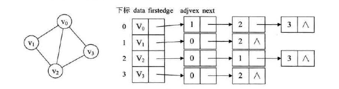

无向图邻接表的创建



图片来源:《大话数据结构》
```
#include <stdio.h>
#include <stdlib.h>
#define MAXVEX 100

typedef char VertexType; //顶点类型
typedef int EdgeType; //边上的权值

typedef struct EdgeNode{
    int adjvex;
    EdgeType weight;
    struct EdgeNode *next;
}EdgeNode;

typedef struct VertexNode{
    VertexType data;
    EdgeNode *firstedge;
}VertexNode,AdjList[MAXVEX];

typedef struct
{
    AdjList adjList;
    int numNodes,numEdges;
}GraphAdjList;


void CreateALGraph(GraphAdjList *G)
{
    printf("请输入顶点的个数和边的个数\n");
    scanf("%d %d",&G->numNodes,&G->numEdges);
    int i;
    //初始化顶点的数据
    for (i = 0;i<G->numNodes;i++) {
        G->adjList[i].data = i;
        G->adjList[i].firstedge = NULL;
    }

    for (i = 0;i<G->numEdges;i++) {
        printf("输入每条边的开始和结束结点以及边上的权值未知\n");
        int start,end,weight;
        scanf("%d %d %d",&start,&end,&weight);
        struct EdgeNode *s,*e;

        s = malloc(sizeof(struct EdgeNode));
        e = malloc(sizeof(struct EdgeNode));
        s->adjvex = end;
        s->weight = weight;
        s->next = G->adjList[start].firstedge;

        G->adjList[start].firstedge = s;

        e->adjvex = start;
        e->weight = weight;
        e->next = G->adjList[end].firstedge;
        G->adjList[end].firstedge = e;
    }
}

int main()
{
    GraphAdjList G;
    CreateALGraph(&G);
    return 0;
}

```
