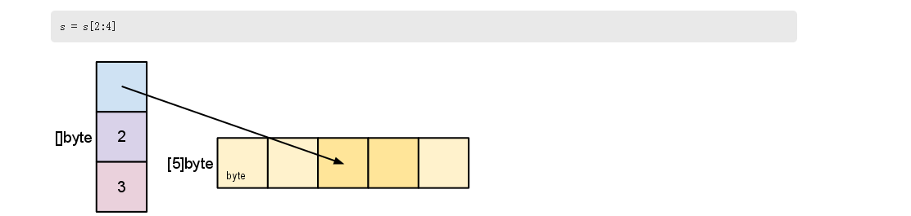

First you should know the usage and internals about  Go slice,if you don't know.You can look it. [Go Slice:uage and internals](https://blog.golang.org/go-slices-usage-and-internals).

This is my understanding from this article：

The length is the number of elements of the slice.The capacity is the number of in the underlying array(beginning at the element referred to by the slice pointer).

You can look the picture below:

In the original Array: the len is 2,the cap is 3.And the slice if define [2:4],so if the value is {1,2,3,4,5},the slice is {3,4}.The cap is value 3,is represent it vlaue can be {3,4,5}.

So this is my understing of the desintct of length and capacity.If you can not understand,you can read the original article is above.
